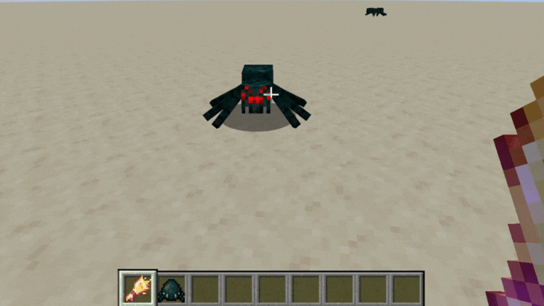

#  Petting   

Welcome to the Petting repository.

Petting is a [Minecraft](https://minecraft.net/) mod that allows players to tame ANY mob. In addition to taming, player can configure the tamed mob's behaivor like making it aggressive/passive, follow/sit etc.

Petting's code is licensed under the [LGPL-3.0 license](https://www.gnu.org/licenses/lgpl-3.0.en.html#license-text) & assets licensed under the [All rights reserved](https://github.com/yigit-guven/Petting/blob/1.21.8-neoforge/LICENSE\_ASSETS)

For information on: [`CONTRIBUTING`](https://github.com/yigit-guven/Petting/blob/1.21.8-neoforge/CONTRIBUTING.md)|[`REPORTING ISSUE`](https://github.com/yigit-guven/Petting/issues/new/choose)|[`SUGGESTION`](https://github.com/yigit-guven/Petting/issues/new/choose)|[`CONTACT`](https://github.com/yigit-guven/Petting#-contact).

## 📝 Project Summary

Petting is a comprehensive Minecraft enhancement module engineered to fundamentally redefine the player-mob relationship through a universal entity affiliation system.

This framework enables players to establish lasting companion bonds with virtually any in-game entity, significantly surpassing vanilla taming parameters. Crucially, the mod integrates granular configuration control over acquired companions, allowing users to define behavior parameters; including stance matrices (aggressive, passive, defensive), tactical movement commands and combat directives managed via an intuitive, dedicated in-game interface.

The core design principle of Petting is to empower the player to transform any selected creature into a valuable, fully customizable, and dependable tactical asset within the Minecraft environment.

### 📸 Media Showcase

#### Taming a Hostile Mob

successfully petting a mob that is typically untamable.

## 📧 Contact

If you want to chat regularly with people who are also interested in [Petting](https://github.com/yigit-guven/Petting) & [Minecraft](https://minecraft.net/) in general you can join our [Discord Server](https://discord.gg/aPk7Qs5d4H).

For business inquiries, project collaboration or any matters not suitable for a public GitHub issue, you can reach the lead developer ([Yigit Guven](https://github.com/yigit-guven)) directly: contact@yigitguven.net

