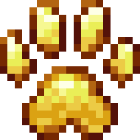

  <h1> Petting</h1>
  
<i>Turn any mob into your loyal, protective companion!</i>

    

  

    <a href="https://github.com/yigit-guven/Petting"><b>GitHub</b></a> •
    <a href="https://github.com/yigit-guven/Petting/wiki"><b>Wiki</b></a> •
    <a href="https://github.com/yigit-guven/Petting/issues"><b>Issues</b></a> •
    <a href="https://discord.gg/aPk7Qs5d4H"><b>Discord</b></a>
  

---

**Petting** is a comprehensive Minecraft mod that reimagines your interaction with the world. Instead of simply fighting monsters, you can now **tame** them! By giving a mob a little love (and the right item), you can transform previously hostile entities like Zombies, Creepers, or even the devastating Wither Boss into fiercely loyal companions that follow you, obey commands, and protect you against all threats.

Designed with extreme configurability and vast quality-of-life improvements, Petting completely unifies with vanilla mechanics, ensuring that your custom monster pets and your vanilla wolves can fight side-by-side without ever turning on you.

---

## 📖 Table of Contents
1. [Core Mechanics: Taming](#core-mechanics-taming)
2. [Pet Behaviors & Commands](#pet-behaviors--commands)
3. [Quality of Life & Pet Safety](#quality-of-life--pet-safety)
4. [Vanilla Taming Integration (Hybrid Pets)](#vanilla-taming-integration-hybrid-pets)
5. [Boss Pet Features (The Wither)](#boss-pet-features-the-wither)
6. [Advanced Configuration (The Config File)](#advanced-configuration-the-config-file)

---

## 🦴 Core Mechanics: Taming

Taming a mob is simple, but deeply customizable. By default, any player can crouch (Shift) and Right-Click a mob using **Golden Wheat** to attempt to tame it.

### Taming Factors
* **RNG Chance:** Taming is not guaranteed! By default, there is a `33%` chance of success (configurable to match vanilla wolves). If you fail, the item is consumed and smoke particles appear.
* **Health Scaling (Optional):** You can enable `healthScalesTamingChance` in the config. If enabled, weakening a mob physically increases your chance of taming it. A mob with 1 HP remaining is far easier to tame than a fully-healed brute!
* **Health Thresholds:** The mod allows server owners to set a `tameHealthThreshold`. If set, a mob **must** be damaged below a certain percentage of its maximum health before taming will even be attempted.
* **Kill Requirements:** If `requireKillToTame` is enabled, a player must have killed at least one entity of that type (recorded in Vanilla player statistics) before they are allowed to tame one.
* **Custom Taming Items:** Servers can map specific items to specific mobs. Want Skeletons to require Bones instead of Golden Wheat? Easily configure it using the `customTamingItems` map!

---

## 🦮 Pet Behaviors & Commands

Once tamed, the mob is yours to command. You can give your pet specific orders by interacting with them empty-handed. Every time you change their state, you receive visual feedback (configurable as Action Bar text, Chat messages, or completely silent).

### The Three States:
1. **Wandering (Default):** Your pet will flexibly follow your trail and defend you if you are attacked, warping to catch up if they fall too far behind.
2. **Sitting (Relaxing):** Your pet will halt all movement and peacefully sit. While sitting, pets will **slowly regenerate health over time**! They will not engage in combat.
3. **Waiting (Guard Mode):** Your pet will stand still, but remain highly alert. They will track nearby entities with their head but refuse to walk away from their post.

### Control Schemes
Players can choose how they interact with their pets via the `controlScheme` config:
* **Classic (Default):** `Right-Click` toggles Sitting. `Shift + Right-Click` toggles Waiting.
* **Right-Click Cycle:** Simply `Right-Click` to cycle smoothly through Wandering -> Sitting -> Waiting.
* **Shift-Right-Click Cycle:** Simply `Shift + Right-Click` to cycle smoothly through Wandering -> Sitting -> Waiting.

---

## 🛡️ Quality of Life & Pet Safety

Having a pet shouldn't be stressful! Petting introduces major passive upgrades to ensure your companions don't die to silly mistakes.

### Pet Infallibility
All tamed pets are natively **immune to Fall Damage, Fire Damage, and Lava Damage**. They can follow you off a cliff or through the Nether without instantly perishing!

### The Pet Whistle 🐐
Lost your pets in a cave? Left them sitting 10,000 blocks away? 
Equip a **Goat Horn**, hold `Shift`, and use the item (Blow the horn). Doing so acts as a universal Pet Whistle, instantly teleporting **all** of your owned custom pets directly back to your side, resetting their state to Wandering!

### NBT/Armor Preservation
When you tame a Zombie wearing Diamond Armor, you want it to keep that armor! Taming organically modifies the existing mob rather than replacing it, completely preserving custom names, NBT tags, naturally spawning weapons, and potion effects.

### Limiters
Server owners can enforce a `maxPetsPerPlayer` soft-cap. If a player reaches this limit, they will be given an error message in chat and prevented from taming any further until they reduce their ranks.

---

## 🐺 Vanilla Taming Integration (Hybrid Pets)

What happens to your Vanilla Minecraft tamed Wolves and Cats? Under Petting, they become **Hybrid Pets**!

When you employ the standard Vanilla taming method (giving a Wolf a Bone), Petting actively intercepts the logic. The animal becomes a standard Vanilla pet (gaining a collar, classic sitting mechanics, and breeding), but it **ALSO** fundamentally receives all Petting Mod tags. This means your Vanilla wolves natively gain:
* Immunity to Fall, Fire, and Lava damage!
* Full teleportation support via the Goat Horn Whistle!
* Direct inclusion in your maximum pet cap!

### Universal Mutual Pacifism
Previously, native Minecraft code caused Wolves or `Doggy Talents Next` dogs to furiously growl at, and inevitably murder, your tamed Skeleton or Creeper pets.

Not anymore. **All Friendly Fire is strictly disabled.** The targeting AI aggressively forces **Native Vanilla Pacifism**. If a Wolf and a Creeper are owned by the exact same player, the mod unconditionally terminates any hostile AI paths between them every single tick, rendering them perfectly peaceful to one another.

---

## 💀 Boss Pet Features (The Wither)

Taming a Wither Boss is the ultimate flex, but their destructive nature can be annoying. We've polished them into perfect bodyguards!

* **True Pacifism:** By default, Withers erratically fire exploding side-heads at any living creature, destroying your base. Tamed Withers have this completely neutralized. Unless you explicitly command them by engaging in combat, stray exploding Wither Skulls are **unconditionally deleted** from reality the millisecond they spawn. Your Wither is completely grief-proof while idle!
* **Boss Bar Hiding:** Taming a Wither normally plasters an obnoxious Boss Health bar at the top of the screeen for the entire server. If `hideTamedBossBars` is enabled, the mod uses advanced reflections to silently wipe the Boss Bar interface across the server for any tamed boss!

---

## ⚙️ Advanced Configuration (The Config File)

Every mechanic described above can be tweaked, disabled, or amplified via the mod's configuration file: `config/petting-common.toml`. 
*You can quickly open your config folder by clicking the "Config" button in the Mod Menu!*

### Config Summary
* **Lists:** Define `tamingWhitelist` and `tamingBlacklist` to strictly control exactly which Entity Registry IDs can and cannot be tamed.
* **Numbers:** Tune the `sitHealAmount`, `sitHealInterval`, `followDistance`, `teleportDistance`, `maxPetsPerPlayer`, `interactionCooldown`, `tameChance`, and `tameHealthThreshold`.
* **Booleans:** Toggle `disableRespawnOnTame`, `enableParticles`, `whitelistOnly`, `blacklistEnabled`, `allowGoldenWheat`, `enableGoatHornWhistle`, `requireKillToTame`, `hideTamedBossBars`, and `healthScalesTamingChance`.
* **Enums:** Configure the `controlScheme` and `commandFeedbackStyle` (ACTION_BAR, CHAT, or NONE).
* **Mappings:** Define `customTamingItems` (e.g., `["minecraft:zombie|minecraft:bone", "minecraft:spider|minecraft:spider_eye"]`).

---

  
🚀 <b>Project Links:</b> 
    <a href="https://modrinth.com/mod/petting">Modrinth</a> | 
    <a href="https://www.curseforge.com/minecraft/mc-mods/petting">CurseForge</a> | 
    <a href="https://github.com/yigit-guven/Petting">Source Code</a> | 
    <a href="https://github.com/yigit-guven/Petting/wiki">Documentation (Wiki)</a> | 
    <a href="https://github.com/yigit-guven/Petting/issues">Bug Reports</a>
  

  <i>Go out and build your ultimate monster army! Made with ❤️ by <a href="https://github.com/yigit-guven">Yigit Guven</a></i>

